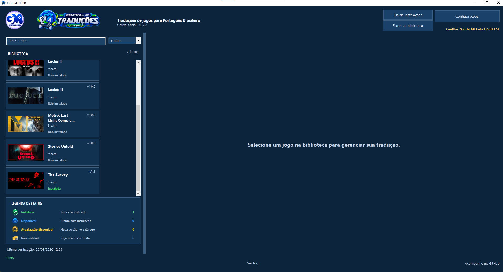
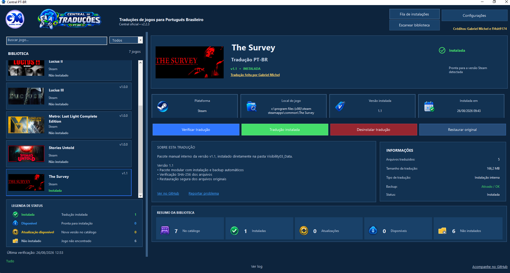
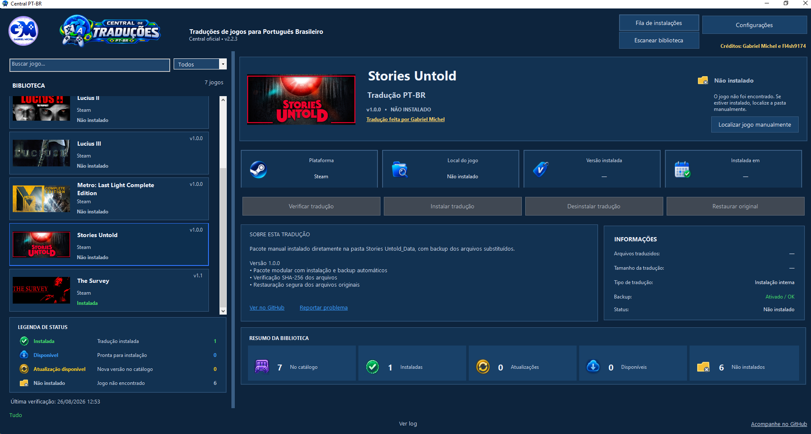

# Olá, eu sou Gabriel Michel! 👋

Faço traduções não oficiais de jogos para **português brasileiro (PT-BR)**, com atenção à clareza, à ambientação e à experiência de quem joga.

## 🎮 Central PT-BR — traduções em um só lugar

A [Central PT-BR](https://github.com/GabrielMichell/central-pt-br) é um aplicativo desktop que ajuda a encontrar, instalar, atualizar e remover traduções de jogos da Steam.

### Como funciona

1. A Central lê o catálogo público de traduções.
2. Você pesquisa o jogo pelo nome e escolhe a tradução disponível.
3. O aplicativo detecta a instalação da Steam pela pasta do jogo e pelo executável.
4. Ele baixa somente os pacotes ZIP declarados no catálogo.
5. Antes de instalar, valida o SHA-256, bloqueia caminhos perigosos e cria um backup dos arquivos originais.
6. Depois, você pode atualizar ou remover a tradução pelo próprio aplicativo, restaurando o backup quando necessário.

A Central não executa instaladores externos `.exe`. Cada projeto informa no catálogo sua versão, compatibilidade, arquivos, destinos relativos e regras especiais de instalação quando necessário.

**[Conheça a Central PT-BR e veja o código do projeto →](https://github.com/GabrielMichell/central-pt-br)**

## 📸 A Central em funcionamento

Veja como a Central organiza a biblioteca de jogos, mostra o estado de cada tradução e permite gerenciar a instalação diretamente no aplicativo.

  

  
  

Os projetos e suas versões aparecem no catálogo da Central, que pode ser atualizado sem precisar procurar cada tradução separadamente.

## 🔎 Sobre meu trabalho

- Tradução e revisão de textos de interface e narrativa.
- Edição de imagens que contêm texto.
- Testes dentro do jogo e correção de quebras de linha.
- Distribuição somente dos arquivos necessários para o patch.

> Meus projetos são feitos por fã, sem vínculo com as desenvolvedoras ou publicadoras. Para usar uma tradução, é preciso ter uma cópia legítima do jogo.

## 🤝 For Game Developers and Publishers

I create unofficial Brazilian Portuguese (PT-BR) translations for games, with a focus on natural language, context, interface and narrative consistency, and in-game testing.

If you are a game developer or publisher and would like to discuss a PT-BR localization, feel free to contact me through GitHub. If a review key is needed to evaluate the game and develop the translation, you are welcome to provide a temporary key. Review keys are used only for translation work; all rights remain with the game’s creators.

When contacting me, please include the game title, platform or store page, and the best way to discuss the project.

## 📬 Contato

Para relatar um problema em uma tradução, abra uma **Issue** no repositório do jogo correspondente.
